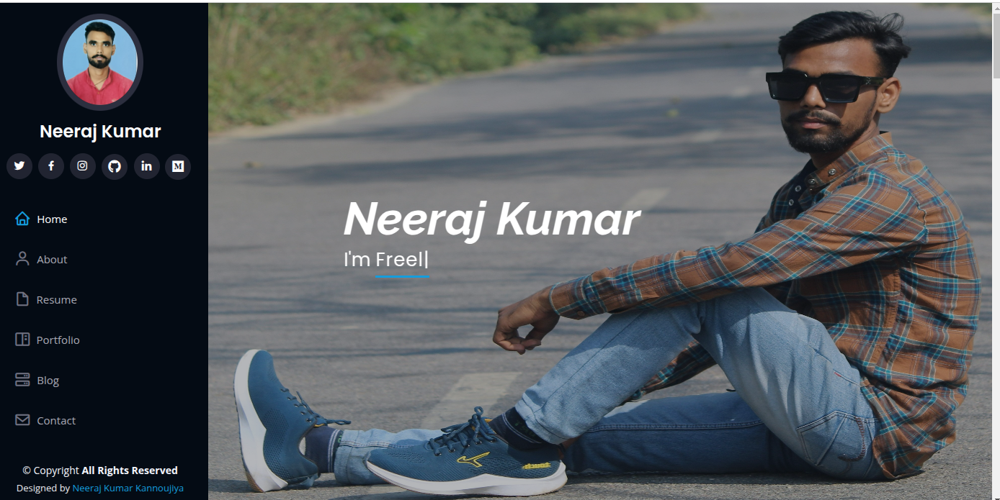
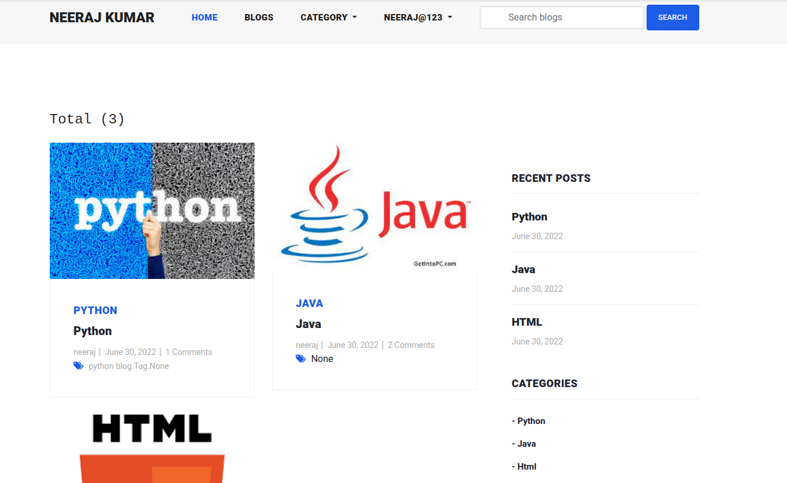
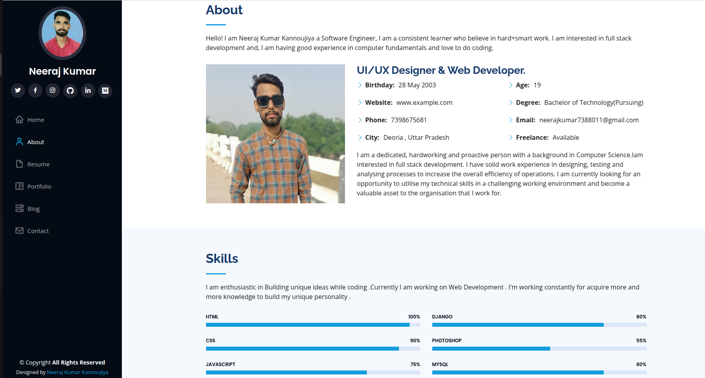

# My Portfolio - Neeraj Kumar Kannoujiya

Welcome to my personal portfolio project! This project showcases my skills, projects, and experiences as a developer. It is built using **Django**, a powerful Python web framework, and includes a blog section where I share my thoughts and insights on various topics.

---

## Table of Contents

- [Project Overview](#project-overview)
- [Features](#features)
- [Installation](#installation)
- [Usage](#usage)
- [Technologies Used](#technologies-used)
- [Screenshots](#screenshots)
- [Contributing](#contributing)
- [License](#license)

---

## Project Overview

This project is a personal portfolio website that includes:
- A **Home** page with an introduction and featured projects.
- A **Blog** section where I share articles and tutorials.
- A **Contact** page for visitors to get in touch with me.
- A **Profile** section to manage user information and blog posts.

The project is designed to be **responsive**, ensuring a seamless experience across devices.

---

## Features

- **User Authentication**: Register, login, and manage your profile.
- **Blog Management**: Create, update, and delete blog posts.
- **Responsive Design**: Optimized for mobile, tablet, and desktop views.
- **Dynamic Content**: Blog posts, categories, and tags are dynamically loaded.
- **Notifications**: Users receive notifications for various actions.
- **Search Functionality**: Search for blogs by title, category, or tag.

---


---

## Installation

To run this project locally, follow these steps:

1. **Clone the repository**:
   ```bash
   git clone https://github.com/your-username/neerajkumarkannoujiya-my_portfolio.git
   cd neerajkumarkannoujiya-my_portfolio

2. **Set up a virtual environment and activate it**:
   ```bash
   python -m venv venv
   source venv/bin/activate  # On Windows: venv\Scripts\activate

3. **Install dependencies**:
   ```bash
   pip install -r requirements.txt
   
4. **Apply migrations**:
   ```bash
   python manage.py migrate

5. **Create a superuser (optional)**:
   ```bash
   python manage.py createsuperuser

6. **Run the development server**:
   ```bash
   python manage.py runserver
Thala. **Access the project**:
Open your browser and go to http://127.0.0.1:8000/.


   

## Usage

### Home Page
Navigate to the home page to view featured projects and an introduction.

### Blog Section
Browse through blog posts, filter by category or tag, and read detailed articles.

### User Profile
Log in to manage your profile, create new blog posts, or update existing ones.

### Contact Page
Use the contact form to get in touch with me.

---

## Technologies Used

### Frontend
- **HTML**
- **CSS**
- **JavaScript**
- **Bootstrap**

### Backend
- **Django**
- **SQLite**

### Other Tools
- **jQuery**
- **FontAwesome**
- **CKEditor**

---

## Screenshots

Here are some screenshots of the project:

### Home Page


### Blog Details


### User Profile


---

## Contributing

Contributions are welcome! If you'd like to contribute, please follow these steps:

1. **Fork the repository**.
2. **Create a new branch**:
   ```bash
   git checkout -b feature/YourFeatureName


## License
This project is licensed under the MIT License. See the LICENSE file for details.
